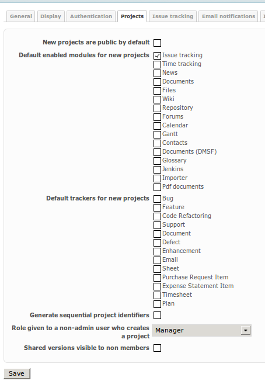

# Redmine Timesheet Application

Tested with Redmine 2.3.3, compatible with 2.x.
Application dependent to the redmine_app__space plugin.

"True" timesheet application, handling time spent on orders rather than on issues, but still being capable of integrating that spent effort in the timesheet.

## Rationale

Timesheet tools are applications useful to track spent time over projects ('orders' in the following, assuming that a project has economics that depend from a contract or internal assignment) and other unproductive activities, such as vacations, leaves, training.

Existing timesheet applications in Redmine are based on the core time tracking capability which is able to record time spent on issues or, alternatively, into a project.
Nevertheless, this is not completely satisfying because:
* not every team is willing to represent features, or orders, as an issue. Many teams use Redmine just to track bugs, and don't want to handle general activities, features, and their economics melted and confused into the same workspace
* unproductive activities are shared company-wide, and its costs have to be monitored as such, so a project context is not sufficient for this scope

The Redmine Timesheet Application plugin implements a global application which includes an administrative part for defining orders and their visibility, supposing that even their existance should not be exposed to unauthorized people (this is a configurable new behavior in global project settings). 
It allows to define brand new orders, but also to include time spent on issues if associated to shared fixed versions and flagged for import.

Time (for the sake of a timesheet) is therefore associated to Versions, in a way that is compatible for calculating the effort spent on versions in usual Redmine views.
Unproductive activities, and other orders that do not have an hosting project, are stored into a dedicated administrative project that does not need to be visible to users filling data into the timesheet app: the issue tracking module needs not to be enabled on it.

## Features

* time tracked over orders, activities and (optionally) issues
* allows to track time on orders independently from projects and issues
* administrative view for orders
* enabling orders selectively
* assign orders to groups and users
* configure activity enumerations per order (enhances visibility management of shared activity definitions)
* support both custom-defined orders and shared versions from projects  
* using the global app space plugin, therefore both the administrative and user views can be enabled to selected user groups and showing in the applications menu if they wish
* reported time compatible with spent time report of Fixed Versions (and of issues if tracked over them)
* permissions for editing own timesheet, view other user's timesheet (readonly), edit other user's timesheet
* daily and weekly view (the time span can be easily changed to arbitrary period via URL only currently)
* daily view manages all time entries and related comments; weekly view aggregates timelogs per order + activity + (opt.) issue
* copy row values to the next period and forward to it
* delete a full row
* flag/unflag time spent on issues to be included or not into the timesheet
* previous period's non-empty rows are displayed into the next period too, for easing the handling of continued activities
* option to completely hide shared versions to users not having visibility into the source project
* hours reported on orders for which the user is not enabled any more are displayed in read only mode

## Installation

Install the redmine_app__space plugin first, then follow the standard Redmine procedure for this plugin, including database migrations.

### General configuration

Create a backing project and, optionally, a new kind of tracker. You can name both of them "Timesheets", but any existing tracker will anyway do the job. Go to the plugin settings and reference them.

Define a group of users enabled to use the administrative view, and a group of users enabled to use the Timesheet application (e.g. All Users). Go to the redmine_app__space plugin settings and enable both applications to the proper user groups.

Visit /settings and unflag the last entry 'Shared versions visible to non members' under the 'Projects' tab if you want to preserve orders completely hidden to people not allowed to know their existence.

Enable the Time Tracking module into the backing project and, optionally, the Issue Tracking module. 
The Issue Tracking module is necessary only if you want to make reports with standard Redmine views out of local orders/fixed versions. The benefit of having it disabled is that you can provide the timesheet feature without the need to make the backing project visible (except if you assign view or edit permissions over other people's timelogs, see below).

### Allowing users to edit or view other user's timesheets

Users (except for admins) can always look at a subset of other people's timesheet, which includes orders they have visibility for too. The principle that order existence should not be disclosed to unauthorized people is preserved.

For shared fixed versions, visibility settings are therefore those defined in the sourcing project, while for "native" orders it is defined into the order assignment to users (see User and Group Visibility below).

Edit or view permission over other people's visible orders is then defined into the backing project. Assign a role which includes the 'view spent time' permission for viewing or the 'edit time logs' permission for editing.

## Usage

Refer to the screenshots below.

## Screenshots

### Order Management

Both "native" orders, and fixed versions shared from projects can be enabled or disabled. Native orders can be further configured.

### Activity Selection

Selecting the activities associated to each specific order.

### User and Group Visibility

Order can be set visible to individual users and/or user groups.

### Weekly View

The weekly view reports aggregated timelogs over an order/activity/issue triple (issue can be missing). This means that each cell may sum values of two or more time entries, related to a specific day, into the same row. Changing the value will create a new timelog entry (if the cell was empty), or will change values or delete entries starting from the last one. 

Shared fixed versions, their project and (if any) the issues are linked in the display.

The week view starts from monday to sunday around the current day. It is also possible to have different period length by changing the 'view' parameter on the URL to a numeric one. For a more detailed view of each entries, refer to the daily view (which is different from setting view=1). Clicking on a day label will bring to the related day view, or you may use the link in the contextual menu.

Entries in a row can be:
* deleted in one shot
* copied to the next period, if the next period is empty
* removed from timesheet if associated to issues, in one shot
* changed activity (after saving)

### Daily View

The daily view reports every single timelog (even when having the same order/activity/issue), and allows for commenting.

### New Rows and Available Entries over Issues

A new row can be added contextually. Hours reported on issues through standard Redmine views can also be added to the timesheet, in order to ease the daily reporting process when already using standard facilities.

### Continued Reporting

Entries that have values in the previous period are listed as empty in the following period too, in order to ease reporting of hours across subsequent periods.

### Readonly Reports

Users can be enabled to inspect other user's timesheets in edit or readonly mode. Above an example of a readonly report.
Individual rows are reported readonly also when an order is not enabled for the user any more, yet some hours have been reported previously.

### Hiding Orders to People Not Allowed

Standard Redmine lists shared Fixed Versions to anybody (although they are not linked). Nevertheless, a company may not want to disclose the existence of every order to anybody.

Visit /settings and unflag the last entry 'Shared versions visible to non members' under the 'Projects' tab.

