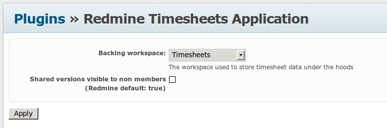
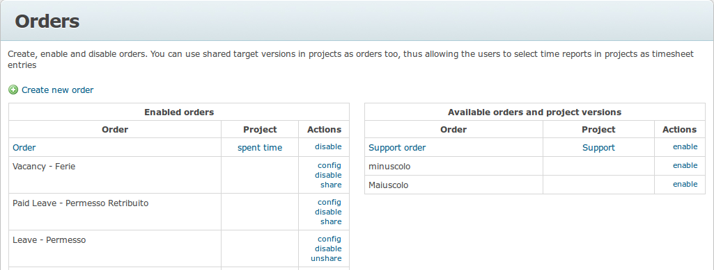
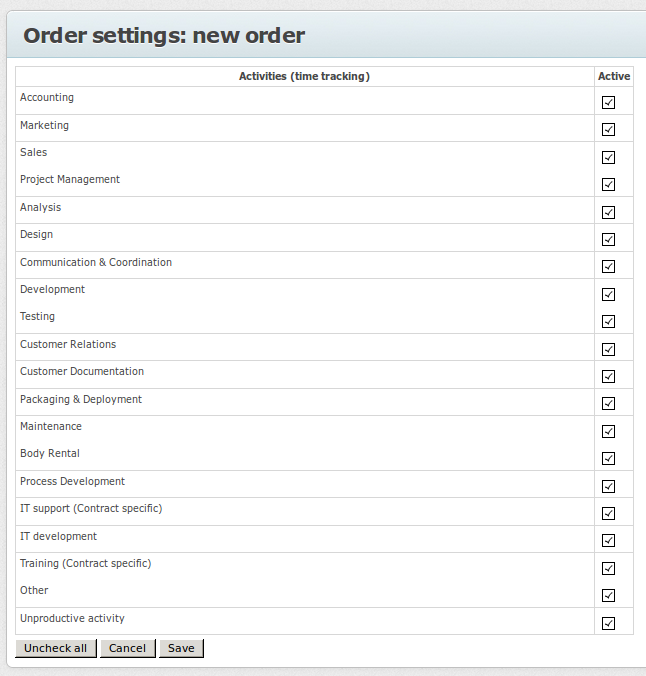
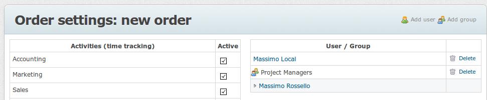
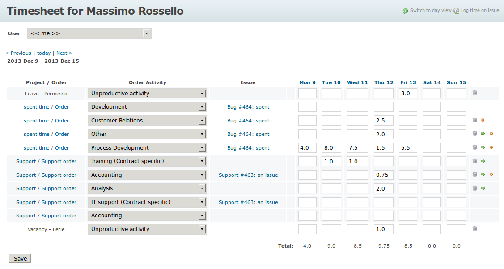
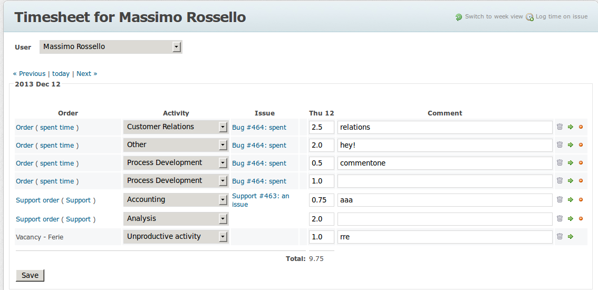
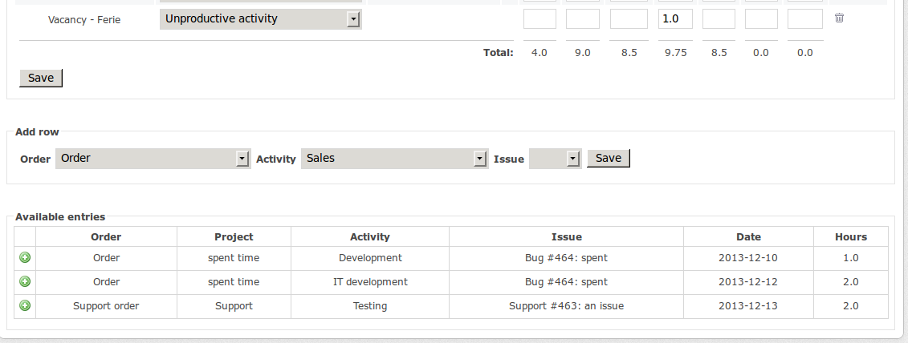
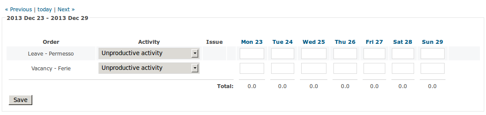
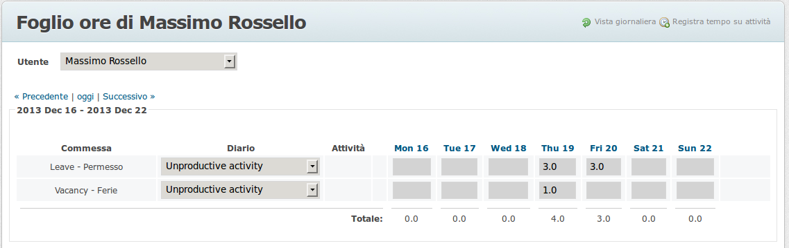
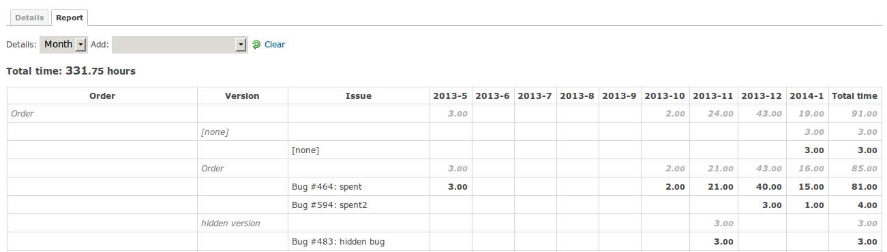

# Redmine Timesheet Application

Tested with Redmine 2.5.2, compatible with 2.x.
Current master branch is version 1.4.x.

Application dependent from the [redmine_app__space](http://github.com/maxrossello/redmine_app__space) plugin.

"True" timesheet application, handling time spent on Orders rather than on issues, but still being capable of integrating that spent effort in the timesheet.

## Rationale

Timesheet tools are applications useful to track spent time over project activities, work orders ('Orders' in the following, assuming that a project
has economics that depend from a contract or internal assignment), general management and other unproductive activities,
such as vacations, leaves, training.

Existing timesheet plugins for Redmine are based on the core time tracking capability which is able to record time
spent on issues or, alternatively, into a project.
Nevertheless, this is not completely satisfying for accounting purposes because:
* not every team is willing to represent Orders as an issue. Many teams use Redmine just to track bugs, and
don't want to handle general activities, features, and their economics melted and confused into the same workspace
* general management and unproductive activities are shared company-wide, and their costs have to be monitored as such,
so a project context is not sufficient for this scope

The Redmine Timesheet Application plugin implements a global application which includes an administrative part for enabling
Orders and defining their visibility (edit own timelogs only, view all timelogs, edit all timelogs) with per-Order granularity.

It allows to define brand new Orders, but also to reuse data about time spent on issues.
Orders can be created globally, in the administrative interface, or locally into projects. In the latter case, they are represented by
Target Versions marked by a special custom field and project Managers can control the access to the Order using normal
roles in the project (Version should be visible).
Both types of Order can then be enabled or disabled administratively.

Timelogs can be reported against issues belonging to a Version for project management purposes, and to a different Order
for accounting purposes (even though Versions can be used as Orders too). The timelog values will be proposed as the easy option
for accounting into timesheets too.

Order activities are disjoint from project activities too. The enumeration is the same, but the Order admin interface
allows for a more granular configuration. A timelog can therefore be also reported with different Activities sets for PM and
accounting purposes.

Redmine's spent time statistics can split for Orders and Order Activities as well, orthogonally to Versions and Activities.

Global Orders are stored into a special administrative project that does not need to be visible to users filling data
into the timesheet, nor any module except Time Tracking needs to be enabled on it.

For backward compatibility reasons, a setting is available that allows to prevent disclosing the existence of
shared Target Versions to people not belonging to its source project (except for admins). This exists because up to
version 1.3.x Target Versions needed to be shared up to the special hidden backend project in order to be recognized
as Orders. This feature may be split in a separate plugin in the future.

## Changelog

### 1.4

Local Orders no not need to be shared with other projects any more. They are recognized as Orders through a special 
custom field that appears in the Version create/edit view.

Project Managers can autonomously make a Version become or not a local Order through the mentioned custom field, and
can re-enable an administratively disabled local Order by re-saving the Version.
If a local Order having timesheet timelogs attached is saved as not being an Order, it is just disabled instead and continues to
appear in the Orders management global view as an Order.

Users having administrative or edit permissions over an Order can edit other user's timelogs even if the latter is not
granted access to the Order any more. In such a situation, time entry cells are colored in light cyan, showing
that they would be readonly for the targeted user.

Fixed some bugs in rendering readonly timelogs.

### 1.3

View/Edit permissions on global Orders can be given through the Order config interface on a per-Order granularity.
Redmine administrators and Orders administrators (those who can access the interface) always have Edit permission on
every Order.

Above interface removes the need to assign role permissions over the timelogs to members into the backing project, and therefore
completely removes the need to enable the Issue Tracking module in it.

Fixed several security issues.

Version 1.3.12 removes the need for hidden issues in the backing project holding access permissions.

WARNING: if you migrate from version 1.2 or below you will have to redefine any view/edit permissions over Orders that you
may have assigned through roles into the backing project.

WARNING: migrating to database migration 11 (removing hidden issues) is not reversible

### 1.2

Activities logged on the timesheet is disjoint from activity logged in the project as well. Therefore, timesheets may
define a lighter, or conversely a more rafinate, set of activities which do not impact project management.

Added Order Activity criteria for spent time.

Significative changes in database, may bring instability.

### 1.1

Target Versions and Orders are now semantically disjointed. This means that you may have a timelog over an issue associated to a Target Version and the timesheet
accounting that on a different Order (GUI to do that will be introduced incrementally). Nevertheless, they are still related in that a shared Target Version can
still be configured as Orders defined in common projects.

Timelogs over issues associated to a shared Target Version will be accounted by default on the same Order.

Spent time reports (/time_entries/report) use Orders as a new split criteria. Activities and issues can therefore be
analyzed both for project management purposes (via Versions) and for accounting purposes (via Orders).

Global Orders can be shared to projects and used with issues for accounting purposes.

### 1.0

First stable version

## Features

* time tracked over Orders, order activities and (optionally) issues without interfering with Versions and project activities
on the same timelogs
* allows to track time on Orders independently from projects and issues
* support both custom-defined global Orders and local Orders defined in projects as Versions marked as such
* administrative interface for Orders
* enable/disable Order to lock data input
* assign global Orders to groups and users
* configure order activity enumerations per Order (enhances visibility management of shared activity definitions)
* assign permissions to individual users over each global Order: edit own times only (default), view other users' times, edit other users' time
* definition and visibility permissions on local Orders are under control of the project's managers
* using the global app space plugin, therefore both the administrative and data input interfaces can be allowed to selected
user groups, and then enabled by them to show in the applications menu
* additional Order and Order Activity criteria in spent time reports
* daily and weekly view (the time span can be easily changed to arbitrary period via URL only currently)
* daily view manages all time entries and related comments; weekly view aggregates timelogs per Order + activity + (opt.) issue
* copy row values to the next period and forward to it
* delete a full row
* flag/unflag time spent on issues to be included or not into the timesheet
* previous period's non-empty rows are displayed into the next period too, for easing the handling of continued activities
* hours reported on Orders for which the user is not enabled any more are displayed in read only mode
* admins and editors on some Order can modify readonly timelogs for other users who can't access any more to it;  
such cells are marked with a light cyan color

## Installation

Install the [redmine_app__space](http://github.com/maxrossello/redmine_app__space) 
plugin first, then follow the standard Redmine procedure for this plugin, including database migrations.

    cd {redmine root}
    git clone https://github.com/maxrossello/redmine_app__space.git plugins/redmine_app__space
    git clone https://github.com/maxrossello/redmine_app_timesheets.git plugins/redmine_app_timesheets
    RAILS_ENV=production rake redmine:plugins:migrate

### General configuration

Create a backing project. Go to the plugin settings and reference it.

Unflag the entry 'Shared versions visible to non members' if you want to preserve Orders hidden to people not
allowed to know their existence. Standard Redmine doesn't allow the usage to non project members, but nevertheless discloses
the name of the Version in some situations.
This setting was mainly necessary with version up to 1.3.x and may be split to a separate login in the future. 

Note that if a shared Target Version is used as an Order, its name will be anyway visible with the issues if assigned to issues
on foreign projects accessible to further users.

Define a group of users enabled to use the administrative view, and a group of users enabled to use the Timesheet application
(e.g. 'everybody'). Go to the redmine_app__space plugin settings and enable both applications to the proper user groups.

Enable the Time Tracking module into the backing project. All other modules (including Issue Tracking) can be off.

NOTE: in order for users to report timelogs over global Orders into standard views (e.g. spent time reports) you need to
assign a role which allows to read timelogs into the backing project. This is not necessary for local Orders, nor
for working with timelogs on global Orders within the Timesheets app.

WARNING: if you migrate from version 1.2 or below you will have to redefine any view/edit permissions over Orders that you
may have assigned through roles into the backing project.

### Allowing users to edit or view other user's timesheets

For local Orders, visibility settings are those defined in the sourcing project, while for global
Orders they are defined into the Order configuration interface.

Users having rights into the Order administrative interface have admin rights over all global Orders but must be explicitly
listed in the Order to be able to handle related timelogs. This allows a less cluttered interface for admins.

## Usage

Refer to the screenshots below.

You can work with timelogs assigned to issues in ordinary projects, assigning Orders and Order Activities on a separate
domain, and/or with global Orders/Order Activities.

Assigning an Order/Order Activity to a timelog spent over an issue does not impact the timelog's Version and Activity set
for project management purposes.

You can mark Target Versions in your projects through a special custom field in order to use them as Orders in the timesheets.

Since 1.3 you don't need to assign role permissions into the backing project except for spent time reports.

## Screenshots

### Plugin Configuration

Configure the backing project. The backing project is an administrative-only one, and will not be
visible to users.

Standard Redmine lists shared Target Versions to everybody (although they cannot be used by not project members).
Nevertheless, a company may not want to disclose the existence of every Order to anybody at all.
Unflag the entry 'Shared versions visible to non members' in order to keep Orders privacy.

Note that if a shared Target Version is used as an Order, its name will be visible with the issues if assigned to issues on foreign projects accessible to further users.

This option may be removed in future as it is not necessary any more since version 1.4.x.

### Order Management

Both global and local Orders can be enabled or disabled. Global Orders can be further configured.

Global Orders can be shared to projects and used with project issues for accounting purposes. They are hidden to unprivileged
users.

### Activity Selection

The left pane of an Order's configuration page allows to select the activities associated to each specific Order.
The set of activities selected for a global Order assigned
to a timelog over a project issue has no relation with the issue's project activities.

### User and Group Visibility

The right pane of an Order's configuration page allows to select individual users and/or user groups who are able to use
the Order, and assign readonly/readwrite permissions over other users' timesheets for the given Order.

Redmine administrators and Orders administrators (those who can access the interface) always have Edit permission on
every Order where they are listed (marked with an angel icon). The requirement to be listed is a help to reduce clutter
in timesheet interface for admins on systems with many Orders.

### Weekly View

The weekly view reports aggregated timelogs over an Order/activity/issue triple (issue can be missing). This means that 
each cell may sum values of two or more time entries, related to a specific day, Order and Activity, into the same row. 
Changing the value will create a new timelog entry (if the cell was empty), or will change values or delete entries 
starting from the last one.

Local Orders' Target Versions, their project and (if any) the issues are linked in the display if visible.

The week view starts from monday to sunday around the current day. It is also possible to have different period length
 by changing the 'view' parameter on the URL to a numeric one. For a more detailed view of each entry, refer to the daily 
 view (which is different from setting view=1). 
 
Clicking on a day label will bring to the related day view, or you may use the link in the contextual menu.

Entries in a row can be:
* deleted in one shot
* copied to the next period, if the next period is empty
* removed from the timesheet in one shot
* changed activity (after saving)

### Daily View

The daily view reports every single timelog (even when having the same Order/activity/issue), and allows for commenting.

### New Rows and Available Entries over Issues

A new row can be added contextually. Hours reported on issues through standard Redmine views can also be added to the
timesheet, in order to ease the daily reporting process when already using standard facilities.

Orders and Versions can be mixed and matched freely as they belong to different domains even if they are derived objects.
Also the Order Activity can be changed once the entry is recorded in the
timesheet, without affecting the original activity set used for project management purposes.

### Continued Reporting

Entries that have values in the previous/following period are listed as empty in the following/previous period as well, 
in order to ease reporting of hours across subsequent periods.

### Readonly Reports

Users can be enabled to inspect other user's timesheets in edit or readonly mode, on a per-Order basis.

For local Orders, permissions over timelogs depend on roles defined in the source projects and can
therefore be managed by the project's managers with no need of admin intervention.

Individual rows are reported readonly also when an Order is not enabled for the user any more, yet some hours have been reported previously.

If the current user can edit some other user's timelogs on an Order that is readonly for the latter, entry cells are
writable but marked with a light cyan color.

### Spent Time Reports

Spent time can be categorized differently for Target Versions (for project management purposes) and Orders (for accounting purposes).

Furthermore, it can be categorized differently for Activities (for project management purposes) and Order Activities (for
accounting purposes).
